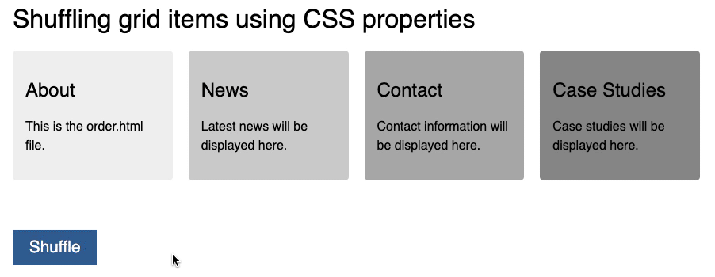

# GridShuffle

An example how to shuffle a CSS grid using custom CSS properties and minimal JavaScript interaction. Check out the [demo page](https://codepo8.github.io/gridshuffle/) for more information and the [blog post](https://christianheilmann.com/2025/11/24/shuffling-a-css-grid-using-custom-properties/).

